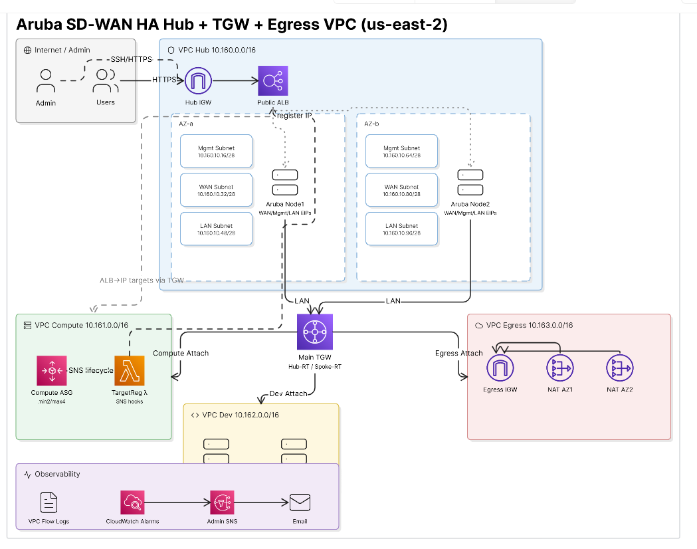

# Aruba EdgeConnect AWS Terraform Lab

Deploy the Aruba EdgeConnect SD-WAN hub AWS lab with Terraform, remote state, and GitHub Actions support.

This repository is the Terraform implementation of the CloudFormation-based Aruba EdgeConnect design. It keeps the same business topology while making the deployment easier to review, version, automate, and promote through repeatable infrastructure-as-code workflows.

## Business Case

Cloud and network teams often need to validate SD-WAN designs before production rollout. This project provides a Terraform-based lab for:

- Deploying Aruba EdgeConnect virtual appliances in AWS
- Testing high-availability SD-WAN hub placement across two Availability Zones
- Validating AWS Transit Gateway hub-and-spoke routing
- Demonstrating centralized internet egress through a dedicated Egress VPC
- Testing application reachability through a public Application Load Balancer
- Practicing GitHub Actions-based Terraform plan/apply workflows

Use the CloudFormation repository for a single-template deployment. Use this Terraform repository when you want modular IaC, remote state, CI/CD, reviewable plans, and safer long-term iteration.

## Topology



## What This Builds

| Area | Resources |
|---|---|
| Hub VPC | Public ALB, Aruba management/WAN/LAN subnets, internet gateway |
| Aruba EdgeConnect | Two EC-V nodes across two Availability Zones |
| Transit Gateway | Hub, Compute, Dev, and Egress VPC attachments with explicit association and propagation |
| Optional VPN | Terraform-managed TGW VPN connections for branch/spoke testing |
| Compute VPC | Auto Scaling Linux web targets |
| Dev VPC | Static Linux web targets |
| Egress VPC | NAT gateways for centralized outbound access |
| Automation | Lambda-based ALB target registration |
| Observability | VPC Flow Logs, CloudWatch support, SNS hooks |
| Delivery | S3 remote state and GitHub Actions workflows |

## Repository Structure

```text
.
├── .github/workflows/
│   ├── bootstrap-state.yml
│   ├── terraform.yml
│   └── terraform-destroy.yml
├── bootstrap/
├── config/
├── docs/
├── images/
├── lambda/
├── prerequisites/
├── scripts/
├── backend.hcl.example
├── terraform.tfvars.example
├── versions.tf
├── variables.tf
├── network.tf
├── security.tf
├── routing.tf
├── compute.tf
└── outputs.tf
```

## Deployment Model

Recommended path:

1. Bootstrap the Terraform state backend.
2. Configure GitHub Actions OIDC access to AWS.
3. Run Terraform format and validation.
4. Generate a Terraform plan.
5. Review the plan.
6. Apply from GitHub Actions.
7. Use outputs to test ALB and Aruba access.

## Deployment Defaults

Project defaults live in:

```text
config/deployment.env
```

Current defaults:

```text
AWS_REGION=us-east-2
TF_STATE_BUCKET=ec-sdwan-aws-s3
TF_STATE_KEY=sdwan/v4/terraform.tfstate
```

## Required Inputs

| Input | Description |
|---|---|
| `key_pair_name` | EC2 key pair for access |
| `restricted_ip` | Admin public IP/CIDR allowed to access Aruba management |
| `aruba_ami_id` | Aruba EC-V AMI ID for the deployment Region |
| `aruba_instance_type` | Aruba EC-V instance size |
| `admin_email` | Optional alarm notification email |
| `alb_certificate_arn` | Optional ACM certificate ARN for HTTPS |

## GitHub Actions Variables

Set these under:

```text
Settings -> Secrets and variables -> Actions -> Variables
```

| Variable | Example |
|---|---|
| `AWS_ROLE_ARN` | `arn:aws:iam::<account-id>:role/<github-actions-role>` |
| `AWS_REGION` | `us-east-2` |
| `TF_STATE_BUCKET` | `ec-sdwan-aws-s3` |
| `TF_STATE_KEY` | `sdwan/v4/terraform.tfstate` |
| `TF_NAME_PREFIX` | `sdwan-v4-lab` |
| `TF_KEY_PAIR_NAME` | `AWS-sid-EC-KP` |
| `TF_RESTRICTED_IP` | `x.x.x.x/32` |
| `TF_ARUBA_AMI_ID` | `ami-xxxxxxxxxxxxxxxxx` |

Optional:

```text
TF_ADMIN_EMAIL
TF_ALB_CERTIFICATE_ARN
TF_ARUBA_INSTANCE_TYPE
TF_COMPUTE_INSTANCE_TYPE
TF_DEV_INSTANCE_TYPE
TF_BACKEND_WEB_PORT
TF_TGW_VPN_CONNECTIONS_JSON
```

`TF_TGW_VPN_CONNECTIONS_JSON` is optional. Leave it unset unless you want
Terraform to create and own site-to-site VPN connections attached to the Transit
Gateway. Example value:

```json
{
  "branch1": {
    "customer_gateway_ip": "203.0.113.10",
    "customer_gateway_bgp_asn": 65000,
    "static_routes_only": true,
    "route_table": "spoke",
    "destination_cidr_blocks": ["192.168.10.0/24"]
  }
}
```

Use `route_table = "spoke"` for branch/spoke VPNs. Use `route_table = "hub"`
only when the VPN should attach to the hub-side TGW route table.

## Local Validation

```bash
cp backend.hcl.example backend.hcl
cp terraform.tfvars.example terraform.tfvars
terraform init -backend-config=backend.hcl -reconfigure
terraform fmt -check -recursive
terraform validate
terraform plan -out sdwan.tfplan
```

Run local apply only when you intentionally want your local AWS profile to deploy:

```bash
terraform apply sdwan.tfplan
```

## Documentation

| Document | Purpose |
|---|---|
| [Architecture](docs/architecture.md) | VPCs, traffic paths, Aruba interfaces, and target registration |
| [Bootstrap](docs/bootstrap.md) | Terraform backend bootstrap runbook |
| [GitHub Actions](docs/github-actions.md) | CI/CD setup and required variables |
| [Operations](docs/operations.md) | Drift checks, deletion protection, and lifecycle notes |

## Cleanup

Use the destroy workflow or run Terraform destroy intentionally from a controlled environment.

```bash
terraform destroy
```

## Cost Notice

This lab creates billable AWS resources, including EC2 instances, NAT gateways, Elastic IPs, Load Balancer, Transit Gateway attachments, Lambda, CloudWatch, and data processing charges. Destroy the lab when testing is complete.
